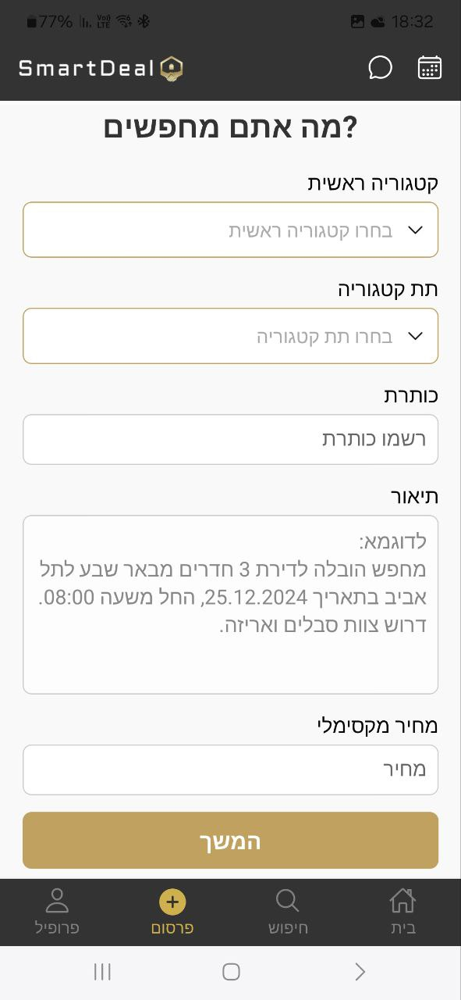
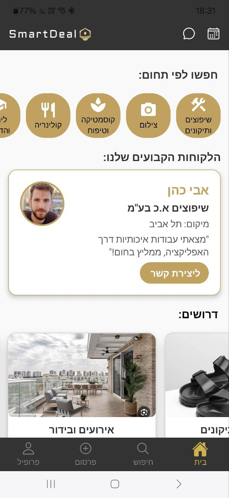

<div dir="rtl">

<p align="center">
  
</p>

אפליקציית SmartDeal היא Marketplace חכמה המחברת בין אנשים המחפשים שירותים מגוונים לבין אנשי מקצוע – בצורה פשוטה, מותאמת תקציב, עם תמחור חכם וחוויית שימוש ידידותית.

---

## תכונות עיקריות

- **חיפוש מתקדם** לפי קטגוריה, מחיר, דירוג ומיקום
- **מערכת דירוגים וחוות דעת** לנותני שירות
- **שליחת הצעות מחיר חכמות** (עד 20% מעל ההצעה)
- **פרסום שירותים עם תקציב מותאם אישית**
- **מערכת דו-כיוונית** – כל משתמש יכול להיות גם לקוח וגם נותן שירות
- **ניהול פרופיל אישי ועסקי** כולל העלאת תמונות, תיאור עסק, ומסכי שדרוג

---

## קהל היעד

- אנשים פרטיים, סטודנטים, פנסיונרים
- שכירים עם זמן פנוי, נותני שירות צעירים, מוסדות חינוך וארגונים חברתיים

---

## סטטוס הפרויקט

✅ פיתוח הסתיים – האפליקציה פעילה ועובדת לוקלית על Android באמצעות Firebase.  
🛠️ מיועדת להצגה כפרויקט גמר, עם אפשרות להמשך פיתוח והפצה בהמשך.

---

## טכנולוגיות בשימוש

- **React Native (Expo 52)**
- **Firebase** (Authentication, Firestore, Storage)
- **React Navigation**
- **React Native Paper**
- **SweetAlert2** (באמצעות custom modal)

---

## התקנה והרצה

```bash
# התקנת תלויות
npm install

# הרצה ב-Expo
npx expo start --clear
```

פתח את QR-code באפליקציית Expo Go בטלפון שלך או הרץ דרך הדפדפן (web).

---

## תמונות מהאפליקציה

### פרסום שירות עם תקציב מותאם אישית



### דף הבית למשתמש



---

## צוות הפיתוח

- **עומר כהן**
- **איתי ונטורה**

---

## GitHub Repository

This project is hosted on GitHub:  
[https://github.com/omercod/SmartDeal](https://github.com/omercod/SmartDeal)

</div>
